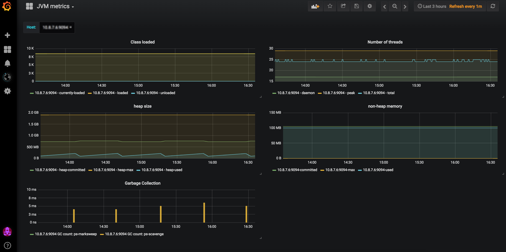

# JVM System metrics
Dashboard of JVM typical metrics when using [Kamon System Metrics](https://github.com/kamon-io/kamon-system-metrics) version used `1.0.0`.

Displays typical JVM metrics:
- Number of loaded classes
- Number of threads
- Heap usage
- Non-heap memory
- GC activity 

